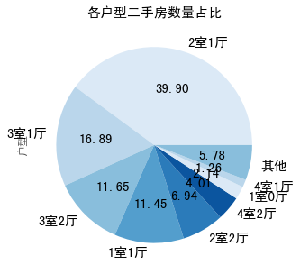

# 北京二手房分析

## 一、概览

数据来源：通过爬虫采集的链家全网北京二手房数据（来自公众号 **Python数据科学**）

数据存储方式：csv文件

数据量：23,677条二手房源数据

分析工具：Python、Pandas库、SeaBorn库、matplotlib库、数据透视表

分析方法：对比法、分组法、交叉法等

## 二、数据说明

据作者说，这是18年的爬虫数据。

### 1.字段说明

原始数据共有12个字段，字段名称及含义如下表所示。

| 字段 | 含义 |
| ---- | ---- |
|Id |该房源在链家网的编号|
| Direction |朝向|
|District |街区|
|Elevator |是否有电梯|
|Floor |楼层|
|Garden |小区|
|Layout | 户型|
|Price |价格|
|Region |行政区|
|Renovation |装修程度|
|Size |面积|
|Year |建造年份|

除了以上数据特征之外，为了分析房价的方便，增加了单价（PerPrice）这一特征值，通过计算`价格/面积`得到的。

### 2.数据规模

共有23677条数据，经过去重后有22468条数据，去掉别墅、商用房等特殊房源后，剩余22446条数据。

### 3.分析目的

主要达到两个目的：

1. 分析该数据集中的各个特征的分布情况

2. 分析房价与各个特征之间的粗略关系，为得到二手房房价计算模型做基础

## 三、分析结果

### 1. 各行政区二手房情况

各行政区数量和占比：

可以看到二手房数量最多的丰台区、海淀区、朝阳区、昌平区，都在2600栋以上，这几个区都在二环以外五环以内，不是太靠近市中心，也不远离城区，工作生活都比较方便，供求都应该是很大的。

从房价来看，东城区和西城区这两个二环的行政区，房价明显领先其他区； 从单价数据的置信空间来看，怀柔、平谷、密云、亦庄、顺义等区的离散程度要大于其他行政区，因为这些区基本都在五环外而且面积较大，包含的房源种类比较多，所以房价离散程度大。

### 2. 二手房的面积分布情况

将面积划分为如下几个组，占比情况如下表所示

从二手房面积分布图来看，面积在100平以下的房源占比达到60%，其中数量最多的是80-100平米的房源，接近1/4。

从面积与价格的散点图可以看到，面积与价格有近似线性的关系，上下限都有明显边界。增加更多特征应该可以得到价格的规律，得到评估房价的准确模型。

### 3. 二手房的户型分布情况

通过对户型特征值直接统计，一共得到了59种户型，其中有很多是比较罕见的户型，如9室3厅 、1室3厅等。分析时取了其中占比达到95%的户型，剩余的5%标记为”其他“。

从图表中可以很明显看到，占比最多的户型为2室1厅，对于家庭来说这种户型确实也是最实用的，从开发商的角度来说，应该也是开发时就比较多的户型。

### 4. 二手房的朝向分布情况

经过统计，数据集中朝向共有59种，除了常见的朝向外，还有一些不太容易理解的，如“东东南南”，“西南西北东北 ”等，可能是爬虫取的数据问题或者是网站录入问题。因此我们取其中占比达到95%的朝向，这些朝向比较普通，也都能理解，剩下的5%标记为”其他“。

从图表可以看出，南北朝向的房子占到了近一半的数量，也符合我们都喜欢南北通透的房子的主观印象，应该也是房屋总数里占比就比较大，不管是新房还是二手房都比较受欢迎的类型。

这个数据也许应该和其他城市对比一下，获取能得到一些更有趣的结论，因为北京地处平原地区，没有太多河道山地，房子的朝向大多是比较周正的，这可以作为一个假设。

### 5. 二手房的装修分布情况

装修这一特征中，“其他”定义不明且占比较大，但占比最大的还是精装类型的；有少量二手房是毛坯房，可能是出于投资需求购入再转卖的。

从面积看，毛坯房的面积较其他类型的二手房面积更大且数据更加离散。

### 6.二手房是否有电梯的分布情况

数据集中有很多数据没有电梯这一特征，我们不知道造成的原因是什么。暂且假设这部分“未知”的数据在有无电梯这两类中是均匀分布的（关于这个假设下文还会提到），那么有电梯的二手房是多于没有电梯的，而且这个差距应该会越来越大。

如果能结合其他城市的数据看一下，这应该可以体现城市的现代化程度。

### 7.二手房的年份分布情况

注意：这里的年份是房源建造的年份。

从上图看，目前市场上的二手房有近一半是2000-2010年的房子，其次是1990-2000年。

在上述特征中，选取了行政区、是否有电梯、装修这三个，做一个时间上的动态分析。

对16个行政区，进行了简单的分类，如下：

并且对当年房源各区域房源的数量对总量进行了归一化，就有了第一张图。因为这张图的横坐标时间是房子的建造年份，因此基本可以看到历年建造房子的行政区分布。可以看到在50年代的房源中，二环的房源占了近乎百分之百；60到80年代的房源，主要是四环内的；80年代之后的房子中，五环区域的占比越来越大了；而在90年代后期的房源中才开始出现各个区县的房子，但数量上仍没有很大优势。这基本反映了北京的发展趋势，二环内的房地产资源逐渐饱和；五环左右是近年来的房地产发展重点区域；并且区县也开始被带动，北京的城市化范围正在逐步扩大至六环和区县。这个图还是很有趣的，虽然不是全部新建房子数量，也可以从二手房市场做一个管窥。

第二幅图分析的是电梯随着房子建造年份的变化，可以看到未录入电梯的数量，分布还算均匀，但是在最后三年的数据中，比例有点飙升，因此这个缺失值一定要想办法填充才能用来分析；90年之后建造的房子里面，没有电梯的占比锐减。

第三幅图是装修随房子建造年份的变化，其他这个不明含义的值看起来是均匀分布的；几种装修类型基本与房屋总数的变化趋势一致；值得关注的是有一部分70年代建造的二手房现在仍是毛坯房。

## 四、结论

本次分析主要对链家网上的北京在售二手房数据进行了描述性分析，主要分析了各个特征在数据集中的占比情况。目前市场上的二手房中：

1. 丰台、海淀、朝阳、昌平区的二手房最多，占比分别为12.28%，12.14%，11.90%，11.85%，这四个区的总和达到了48%，占市场的一半；
2. 房价与行政区的关系还是比较明显的，这是计算房价的一个重要特征；
3. 80-100平米的房子最多，占到了24.14%，其次是60-80平米的型房子，占21.71%；
4. 房价与面积存在近似线性关系，斜率即单价在一个范围内；
5. 户型最多为二室一厅，占到39.90%，其次是三室一厅，占到16.89%；
6. 48.39%的二手房都是南北朝向，其次是朝南的房子，占到了12%；
7. 大部分的二手房都是精装，简装（存在位置含义的标记，不能给出准确占比）；
8. 电梯特征存在很多缺失值，不能给出准确值，大致来看也是有电梯的稍多一些，并且随建造年份电梯房越来越多；
9. 48.78%的房子都是2000-2010年间建造的，其次是1990-2000年的房子，占比24.85%。

## 五、代码

[github地址](https://github.com/wsybupt/data_analysis_practice/blob/master/beijing_second_hand_house_deal/analysis_code.ipynb)

如果github加载失败，请访问这个地址：

[nbviewer地址](https://nbviewer.jupyter.org/github/wsybupt/data_analysis_practice/blob/master/beijing_second_hand_house_deal/analysis_code.ipynb)

## 六、辛普森悖论

分析时总想把每个特征都跟房价做一个关系图，这样做并不合适； 一方面，影响房屋均价的因素很多，单独分析一个特征意义不大；另一方面，单独分析一个特征和房价的关系可能会出现辛普森悖论。

比如在分析朝向和房价的关系，我发现南北朝向的房子是市场上最多的房子，按常理说它的价格应该比其他朝向的房子要高，但是绘制出图表之后，南北朝向的房子单价却是所有朝向里最低的。

我算出了【单价关于行政区和朝向的数据透视表】和【数量关于行政区和朝向的数据透视表】之后才看到，在各个行政区，南北朝向的房源单价都是比较高的，同时在各个区南北朝向的房子数量也是最多的，但是在市中心热门行政区南北朝向的房子数量与其他朝向房子的数量大概相差10倍左右，但是在偏远区南北朝向的房子数量与其他朝向房子的数量相差大概在40倍左右，因此这些偏远地区的低房价对于南北朝向的平均值影响更大，把整体均值拉下来更多。这是一个典型的辛普森悖论，因此我考虑孤立地在很多特征上单独看房价意义不大。

